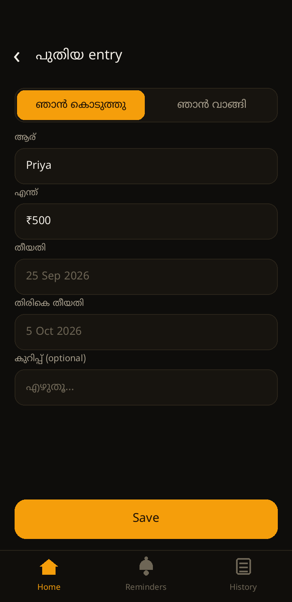
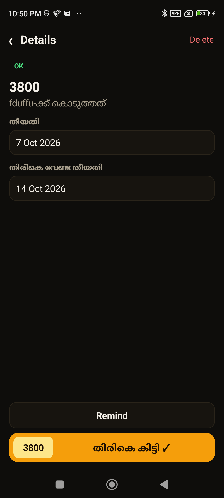
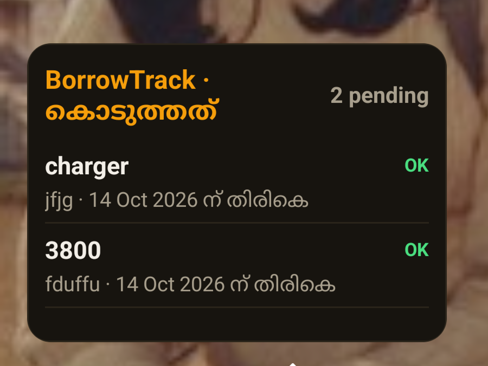

# BorrowTrack

A simple, private IOU tracker for Android — keep track of what you lent and borrowed, with due-date reminders, partial repayment updates, and home screen widgets.

- 📋 **Lent / Borrowed entries** (person, item, date, due date, note) — 100% offline
- 💵 **Partial Repayment Updates**: Easily update partially closed items or money borrowings (e.g. borrowed 2000 and returned 1000)
- 🧩 **Home Screen Widgets**: Dedicated real-time widgets for **Lent Items** (*കൊടുത്തത്*) and **Borrowed Items** (*വാങ്ങിയത്*)
- 🔔 **Notification Reminders**: Automatic notifications on due dates (9 AM)
- 📜 **History Log**: Track completed returns with press-and-hold deletion
- 💬 **One-tap WhatsApp Reminders**: Send friendly Malayalam reminder messages with one click
- 🇮🇳 **Malayalam-first UI**: Clear, intuitive local interface

Built with native Kotlin and AndroidX, 100% offline and private.

## Screenshots

| Home | Add entry | Details & Partial Return | Home Screen Widget |
|------|-----------|--------------------------|--------------------|
|  |  |  |  |

## Build & Run

### Windows (Automated Build & Run Script)

Build, install, and launch directly on a connected ADB Android device with a single command:

**Command Prompt (CMD):**
```cmd
win-build.bat
```

**PowerShell:**
```powershell
.\win-build.ps1
```

### Linux / WSL

```bash
bash app/offline-build.sh assembleDebug
```

**APK Output**: `app/app/build/outputs/apk/debug/app-debug.apk`
